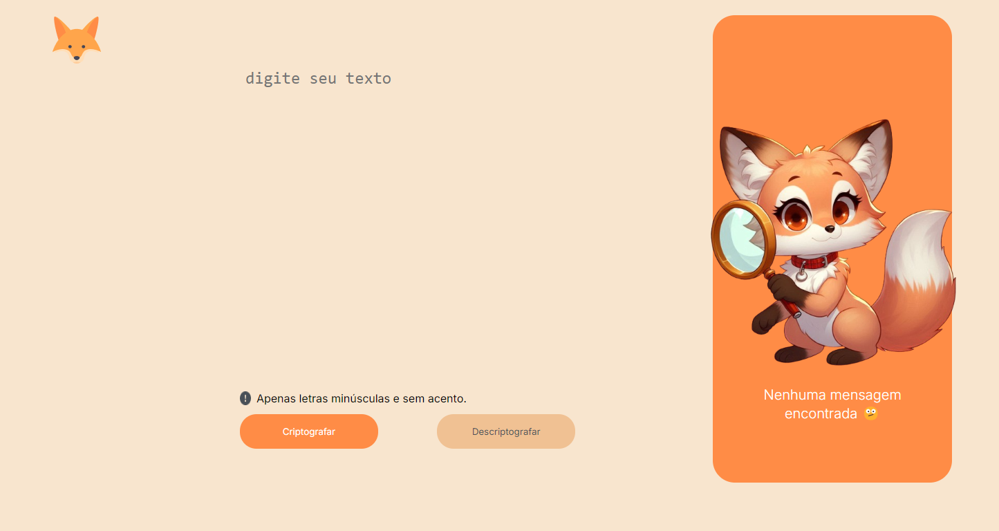

# Olá, sejam bem vindos! 😃 

<h1 style="color:orange">Decoder Fox 🦊</h1>

<h3>O codificador e decodificador de textos</h3>

<h4>Esse é um projeito para entrega do Challenge do curso de formação de iniciantes em programação através da Oracle em parceria com a Alura. <h4>

<h4>O obejtivo do desafio é criar um programa para criptografar e descriptografar textos seguindo as instruções do desafio.<h4>

As "chaves" que foram utilizadas para a criptografia são: 
 
A letra "e" é convertida para "enter" 
A letra "i" é convertida para "imes" 
A letra "a" é convertida para "ai" 
A letra "o" é convertida para "ober" 
A letra "u" é convertida para "ufat" 
